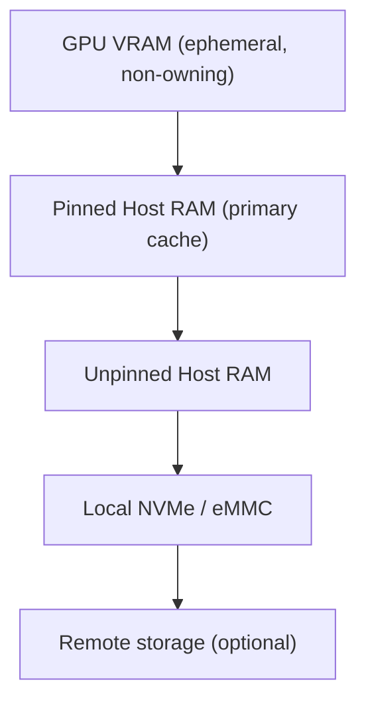

# HANS Edge Design

This document describes how HANS — Hardware-Aware Neural Storage — is designed
to operate on edge devices with constrained resources, especially limited
GPU VRAM, power, and thermal budgets.

Edge deployments are treated as a first-class target, not a scaled-down
datacenter.

---

## Design Goals for Edge

HANS on edge devices prioritizes:

- **Predictable performance over peak throughput**
- **Stability under memory pressure**
- **Minimal GPU idle time**
- **Graceful degradation**
- **Low operational complexity**

Edge devices include (but are not limited to):

- NVIDIA Jetson family (Nano, Xavier, Orin)
- Embedded RTX platforms
- Industrial AI gateways
- Battery-powered or thermally constrained systems

---

## Core Constraints

### 1. Limited VRAM

- VRAM is often shared with system memory
- VRAM capacity is small (2–8 GB typical)
- GPU OOM events are catastrophic for edge workloads

### 2. Limited System Memory

- CPU RAM is often constrained
- Memory fragmentation is common
- Swapping is often disabled or undesirable

### 3. Power & Thermal Limits

- Sustained I/O and prefetching can trigger throttling
- Power draw must be considered in cache behavior

### 4. Intermittent Connectivity

- Persistent storage may be remote or unreliable
- Edge systems must tolerate restarts and disconnects

---

## Memory Hierarchy on Edge

HANS enforces a strict, conservative hierarchy:

### Key Rules

- VRAM is **never treated as durable cache**
- VRAM allocations are **time-bounded**
- Host RAM is preferred over VRAM for caching
- NVMe is used as a spillover tier, not a default

---

## VRAM Policy

### VRAM Is a Staging Area

VRAM is used only for:
- In-flight tensors
- Immediate inference or training steps
- Short-lived buffers tied to active GPU kernels

VRAM is **never**:
- Used for long-lived cache residency
- Used to store full files or datasets
- Used without explicit pressure checks

### VRAM Admission Control

Before staging data in VRAM, HANS checks:
- Current free VRAM
- Active GPU kernels
- Job priority
- Estimated residency time

If constraints are violated, data remains in pinned host RAM.

---

## Chunking Strategy for Edge

Edge deployments use **micro-chunking**.

### Default Chunk Sizes

- Edge: **64 KB – 1 MB**
- Datacenter: 8 MB – 64 MB

### Rationale

- Smaller chunks reduce VRAM spikes
- Enable fine-grained prefetching
- Reduce wasted memory for partial access

Chunk size is dynamically adjusted based on:
- GPU memory pressure
- Access locality
- Job type (inference vs training)

---

## Pinned Host Memory Strategy

Pinned (page-locked) host memory is the **primary cache tier** on edge.

Advantages:
- Fast GPU transfer via DMA
- Avoids page faults during kernel execution
- More predictable than Unified Memory

HANS aggressively reuses pinned buffers to avoid fragmentation.

---

## Prefetch Behavior on Edge

Prefetching is intentionally conservative.

### Prefetch Rules

- Shallow prefetch depth
- Prefetch only when GPU utilization is high
- Disable prefetch under memory or thermal pressure
- Never prefetch into VRAM

Prefetch targets pinned host RAM or NVMe.

---

## GPU-Aware Backpressure

HANS continuously monitors GPU signals:

- Utilization
- Kernel launch latency
- Memory pressure
- Stream stalls

### Backpressure Responses

| Signal | Response |
|------|----------|
| VRAM pressure | Reduce chunk size |
| GPU idle | Increase prefetch |
| Thermal throttle | Pause background I/O |
| Memory pressure | Trigger early eviction |

This feedback loop is critical for edge stability.

---

## Power-Aware Behavior

On edge devices, power is a first-class signal.

HANS adapts by:
- Reducing background persistence
- Scaling down prefetch aggressiveness
- Prioritizing foreground reads

Power-aware behavior is profile-driven and configurable.

---

## Failure Model on Edge

HANS assumes:
- Unexpected restarts
- Partial cache loss
- Network disconnects

As a result:
- Cache metadata is treated as best-effort
- Persistence is asynchronous
- Recovery favors correctness over cache reuse

Edge systems must always recover safely.

---

## Summary

HANS edge design is intentionally conservative and explicit.

By treating VRAM as ephemeral, prioritizing pinned host memory, and reacting
to real-time hardware signals, HANS enables stable and high-performance AI
workloads on devices that traditional file systems cannot handle reliably.
